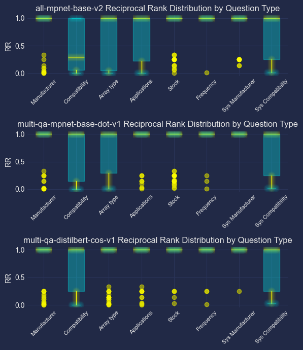
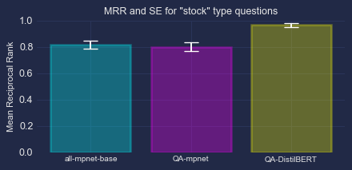
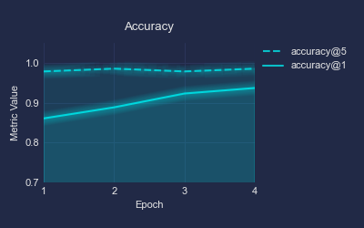
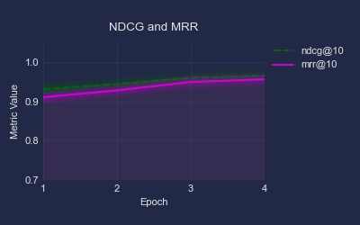
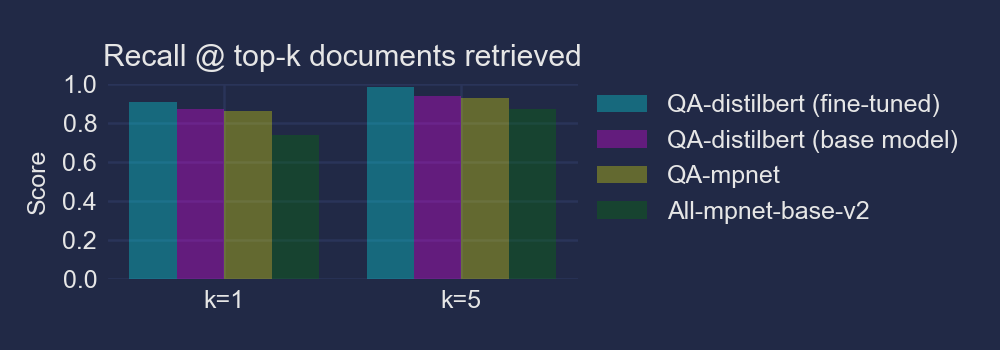
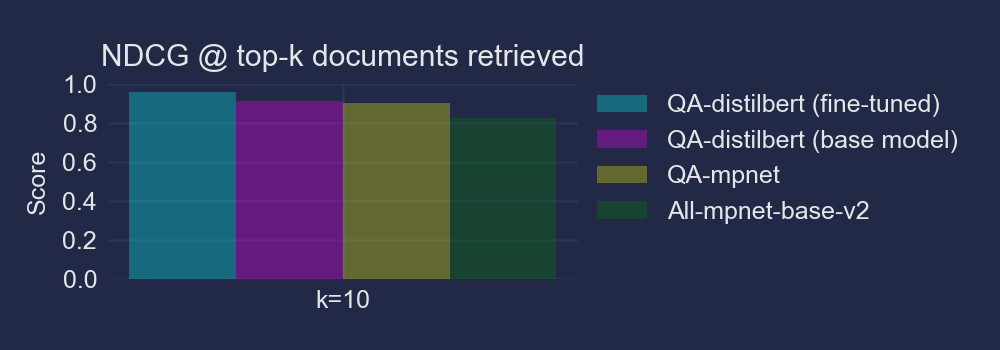

# QA Information Retrieval System using Fine-Tuned DistilBERT


## Project Overview

This project focuses on developing and fine-tuning a question-answering (QA) information retrieval system to help customers find information about various medical equipments. The system is built using the [multi-qa-distilbert-cos-v1](https://huggingface.co/sentence-transformers/multi-qa-distilbert-cos-v1) model and fine-tuned on a custom dataset of 324 documents and 963 queries that emulate real customer inquiries about the company's products.

To develop the system, we first generate a document corpus from tabular data and create synthetic queries using a local large language model (LLM). We then evaluate pre-trained embedding models from HuggingFace, perform Bayesian optimization for hyperparameter tuning, and fine-tune the most promising model using our customized document-query dataset.

The fine-tuned DistilBERT model consistently outperformed other pre-trained models on a holdout test set across various performance metrics, showcasing the effectiveness of the fine-tuning process and the model's adaptability to the specific domain and data characteristics.

## Project Resources

Below, you'll find information on where to locate specific files:

- [`notebooks/qa_system.ipynb`](notebooks/qa_system.ipynb): This Jupyter Notebook contains the majority of the code used in the project, including data cleaning, query generation using OLLaMA, significance testing, Bayesian optimization, and fine-tuning of the selected model.

- [`docs/`](docs/): The "docs" folder contains the following important documents:
  - [`Capstone_Final_Report.pdf`](docs/Capstone_Final_Report.pdf): The final report for the capstone project, detailing the project's objectives, methodology, results, and conclusions.
  - [`Capstone_3_Presentation.pptx`](docs/Capstone_3_Presentation.pptx): The PowerPoint slides used for the capstone project presentation.
  - [`Capstone_3_Presentation.pdf`](docs/Capstone_3_Presentation.pdf): A PDF version of the capstone project presentation slides.

- [`images/`](images/): The "images" folder contains various plots and charts generated throughout the project.

Feel free to explore these resources to gain a deeper understanding of the project's implementation, findings, and deliverables.

## Data

The project utilizes two datasets that were created from a portion of the company's catalog:

1. **probes.csv**: This dataset contains information about various ultrasound probes, including the probe model, manufacturer, compatible systems, array type, frequency range, and stock availability.
2. **systems.csv**: This dataset contains information about different ultrasound systems, including the system model, manufacturer, and compatible probes.

## Methodology

### Converting Tabular Data into Documents

To prepare the data for the QA system, the tabular data from `probes.csv` and `systems.csv` was converted into human-readable text documents. Each row, column, and cell was transcribed into sentences using a python script.

### Generating Synthetic Queries using LLM

A large language model (LLM), llama3, was utilized to generate a diverse set of synthetic questions based on the information provided in each document. The prompt template provided examples of concise, answerable questions based on the information within each document. The model was instructed to generate three questions per document and structure its response as a numbered list.

```python
prompt = """Generate three concise questions that can be answered using the following information, similar to the example provided. Provide only the questions, numbered as follows:

1. [insert question here]
2. [insert question here]
3. [insert question here]

Example 1:
Information: The manufacturer of the C3 probe is ATL.
Questions:
1. Who is the manufacturer of the C3 probe?
2. Who makes the C3 transducer?
3. Is the C3 probe made by ATL?

Information: {document}
Questions: """
```

A regular expression function was created to look for a sequence of a number followed by a period, whitespace, and then capture the text until the first question mark. This allowed us to parse the outputs, map each question onto its corresponding document and tags, and create a training dataset containing question-document pairs.

Another LLM prompt was employed to score each question-document pair based on its relevance. Any question-document pairs deemed irrelevant were manually reviewed and re-scored if necessary. These pairs were then merged back into the final dataset.

The final fine-tuning dataset comprised 963 queries and a corpus of 324 documents.

### Evaluating Pre-trained Embedding Models

Three pre-trained embedding models from Hugging Face were evaluated: [all-mpnet-base-v2](https://huggingface.co/sentence-transformers/all-mpnet-base-v2), [multi-qa-mpnet-base-dot-v1](https://huggingface.co/sentence-transformers/multi-qa-mpnet-base-dot-v1), and [multi-qa-distilbert-cos-v1](https://huggingface.co/sentence-transformers/multi-qa-distilbert-cos-v1). 

To compare the performance of the pre-trained embedding models across different question types, a one-way ANOVA (analysis of variance) was conducted on the Mean Reciprocal Rank (MRR) scores followed by post-hoc Tukey HSD (honestly significant difference) tests to determine which specific model pairs had significantly different MRR scores. The `multi-qa-distilbert-cos-v1` model was selected for fine-tuning as it demonstrated the best performance, scoring equally as high if not the highest across all question types.






### Bayesian Optimization

Bayesian optimization was employed to find the optimal hyperparameters for fine-tuning the multi-qa-distilbert-cos-v1 model. The search space included `per_gpu_batch_size`, `weight_decay`, `learning_rate`, `warmup_steps`, and `num_epochs`. The optimization process aimed to maximize the MRR metric on the validation set.

### Fine-tuning

The `multi-qa-distilbert-cos-v1` model was fine-tuned using the best hyperparameters obtained from Bayesian optimization. The `MultipleNegativesRankingLoss` function was used as the loss function, which encourages the model to assign higher probabilities to relevant documents and lower probabilities to irrelevant ones. Various performance metrics, such as accuracy, recall, MRR, and NDCG (Normalized Discounted Cumulative Gain), were observed over the training process lasting 4 epochs.





### Model Performance and Comparison

The fine-tuned DistilBERT model was evaluated on a holdout test set and compared against three other pre-trained models: `multi-qa-distilbert-cos-v1`, `multi-qa-mpnet-base-dot-v1`, and `all-mpnet-base-v2`. The fine-tuned model consistently outperformed the other models across all performance metrics, demonstrating the effectiveness of the fine-tuning process and the model's ability to adapt to the specific domain and characteristics of the company's data.






## Conclusion

This project successfully developed a QA information retrieval system using a fine-tuned DistilBERT model to answer customer queries about ultrasound probes and systems. The system's performance highlights the importance of tailoring the model to the specific domain and data characteristics. Future work could explore expanding the QA system to handle more complex queries and integrate large language model chains with structured database queries for even more accurate and comprehensive responses.

## Libraries & Dependencies

- Python 3.x
- numpy
- pandas
- torch
- sklearn
- matplotlib
- sentence-transformers
- statsmodels
- langchain